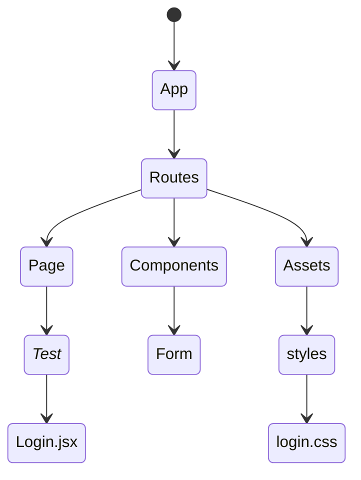

#### Setup Structure ####:

### Create folders in /src:

    	- components,
    	-	assets,
    	- context,
    	-	hooks,
    	-	pages,
    	- layouts

### Create folders in components, assets,context,hooks,pages,layouts:

    	- _test_

### Create folders in components:

    	- form
    	- ui

### Create folders in assets:

    	- fonts
    	-	images
    	- styles

#### Data Fetching

    - Where? and How?

    Where? : context.jsx file

    How? :

    import React, {useContext, useEffect} from 'react'

    const AppContext = React.createContext()

    const AppProvider ({children}) =>{

    	useEffect(() =>{
    		console.log('Fetch data here)
    	},[])

    return (
    	<AppContext.Provider value={{}}>
    	{children}
    	</AppContext.Provider>
    )
    }

# Login Structure Folder

